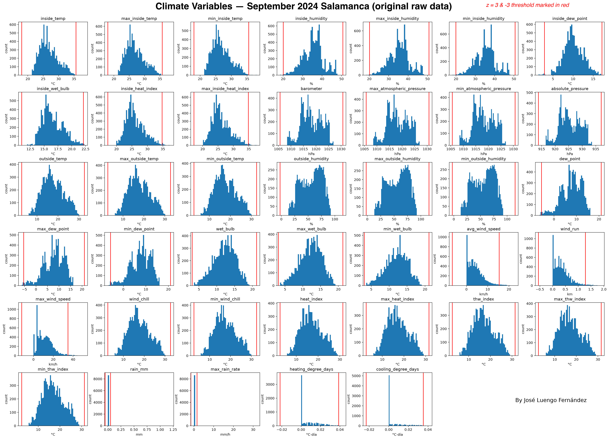
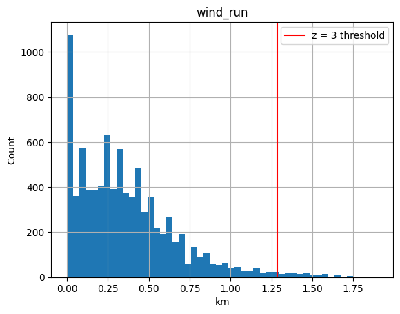

# station-data 

The goal of this project is to analyze 27 years of original raw climate data using Pandas and SQL. 





### Current Status: (in progress) 

- Cleaning and Parsing of the September 2024 csv
    - Corrupted Names   (M�xima Temperatura...) and nested double quotes.
    - Type conversion
- Missing values 
    - Detection of NaN values
    - Interpolated missing values
- Outlier detection
    - Computed z-score for each measurement 
    - Found out that `avg_wind_sppeed` and `wind_run` don't follow a normal distribution. 
    - Histogram visualization with z = 3 threshold. 





### Structure

```
data/
  A-2024/
    geo_raw_2024_09.csv    # raw data
    geo_clean.csv          # clean data (September 2024)
cuadernos/
  3_era_exploration.ipynb  # exploration: cleaning + outliers
src/
  ...
```