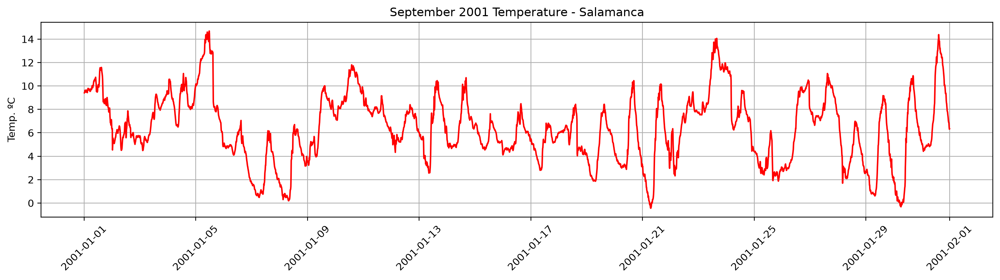

# station-data 

The goal of this project is to analyze 27 years of original raw climate data using Pandas and SQL. 

There are various eras in the data, each one with its own problems.


### Current Status: (in progress) 

- Cleaning and Parsing of the September 2024 csv
    - Corrupted Names   (M�xima Temperatura...) and nested double quotes.
    - Type conversion
- Missing values 
    - Detection of NaN values
    - Interpolated missing values
- Outlier detection
    - Computed z-score for each measurement 
    - Found out that `avg_wind_sppeed` and `wind_run` don't follow a normal distribution. 
    - Histogram visualization with z = 3 threshold. 

- Era 2 (Automatic station, 2000-2021)
    - Pilot cleaning of `F2001-01.xls` (not published).
    - Separated measurement rows from daily summary rows (`Total`).
    - Renamed columns following my project naming convention.
    - Parsed the raw time column (`H`) and handled `24:00` timestamps by shifting them to the next day.
    - Created a unified `date` datetime column and validated the temporal consistency of the time series.
    - Visualized temperature evolution during september to confirm that the data is correct.





### Structure

```text
data/
  A-1998/ ... A-2024/

images/
  example_temperature.png
  september_2024_distributions.png
  wind_run_histogram.png

notebooks/
  2_era_exploration.ipynb
  3_era_exploration.ipynb

src/
  loaders/

LICENSE
README.md
```