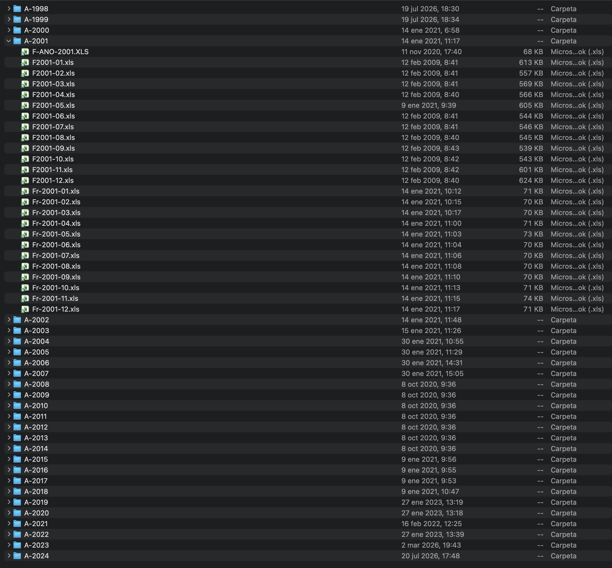
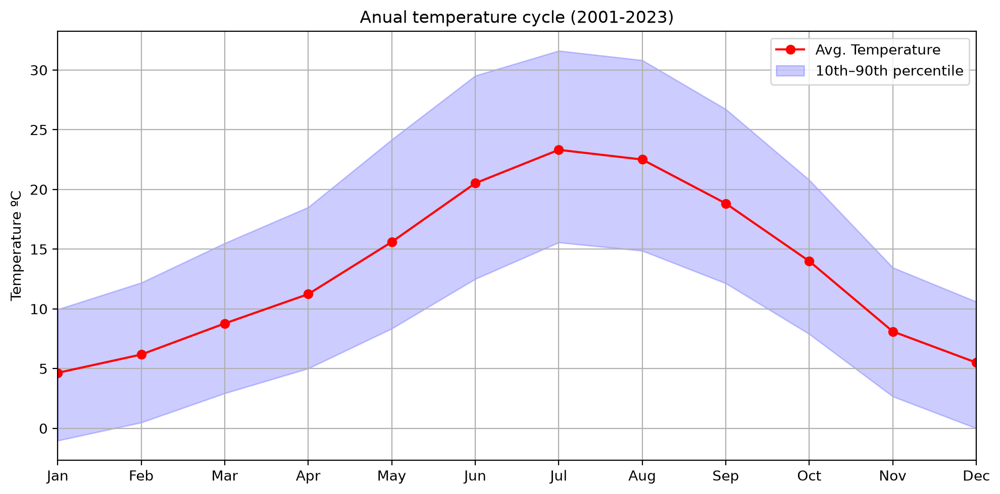
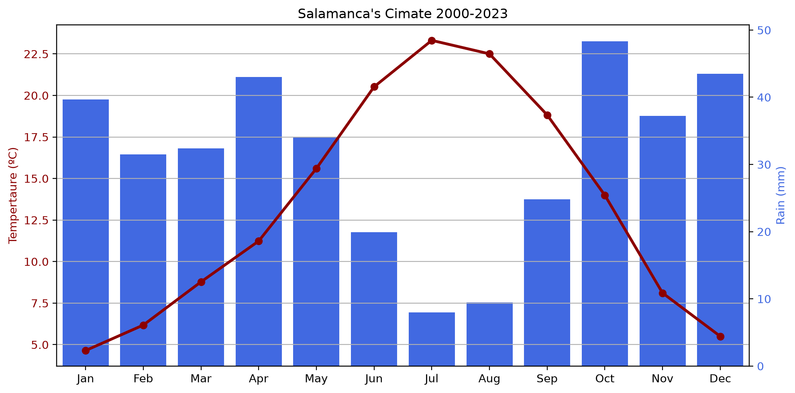
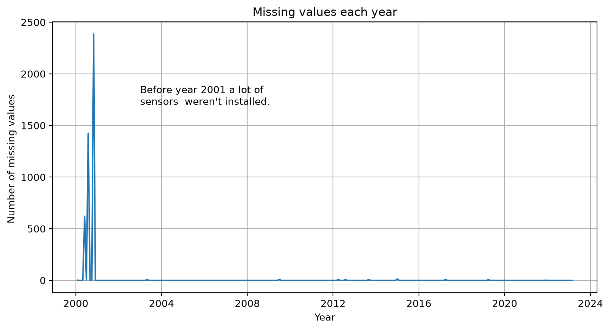
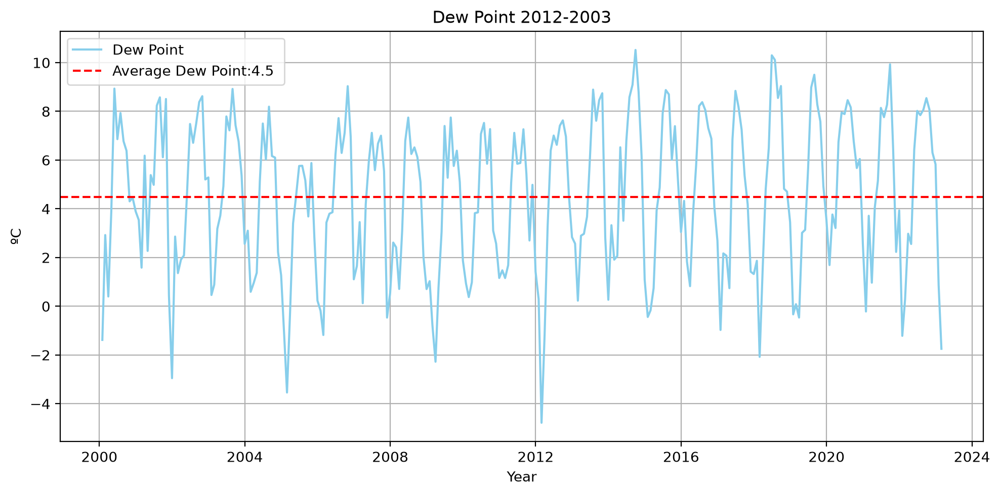
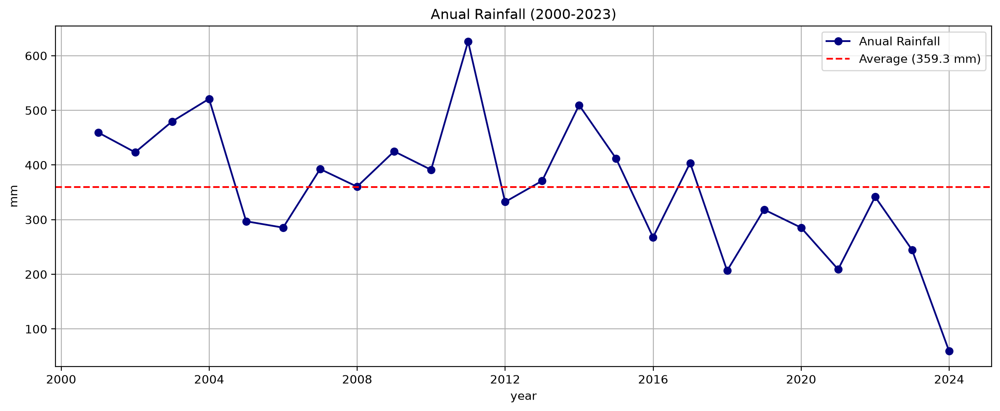
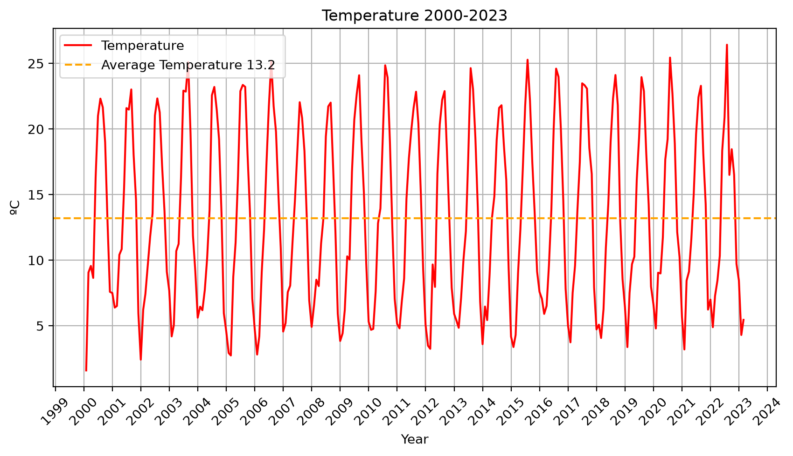

# station-data 

En este proyecto **preparo y analizo datos** de una estación meteorológica de la USAL de 2000 a 2023 con **Pandas y SQL.** 🌦️ 

### Instalación e introducción

> **Nota sobre los datos:** son originales y no están publicados. No están incluidos ni los excels ni la base de datos ni el parquet construido. El repo tiene el pipeline entero de ETL para portfolio. El código en src/ y los notebooks muestran el proceso. Si necesitas ejecutarlo avísame. 

Clona el repositorio e instala las dependencias:

```bash
git clone https://github.com/joslfer/station-data.git
cd station-data
python3 -m venv venv
source venv/bin/activate
pip install -r requirements.txt
```

Puedes revisar todo en `notebooks/`:

```bash
jupyter notebook notebooks/
```


Los datos estaban con todo tipo de formatos. Una vez parseados, limpiados y ordenados en una base de datos, los he analizado respondiendo cuestiones relevantes y dibujando gráficas para entenderlos bien. 

La estación meteorológica registró en su día en formato antiguo de excel, xls. A medida que pasaron los años, se fueron añadiendo instrumentos nuevos (radiómetro, higrómetro) y cambió la forma de medir junto con los nombres. Poder llegar al final a una base de datos limpia ha sido la parte más difícil. 

Originalmente iba a construir la base de datos incluyendo datos de 1998, 1999 y 2024 pero estos tenían un esquema de datos distinto entonces decidí hacerlo de 2000-2023 analizando 2024 por separado. 
Los datos de la era principal (big era) están en carpetas y divididos en excels mensuales.

<p align="center">
  
</p>

Se midió (en inglés): `temp`, `humidity`, `vapor_pressure`, `dew_point` y `rain_mm`. Luego se añadió `vapor_deficit`, `radiation` y `radiation_accum`. Las medidas son cada 10 segundos, y cada diez minutos se obtiene una media que va como datapoint al excel mensual. Cada día en el excel tiene 144 datos climáticos. 

### Parte 1/2: preparar los datos

He tenido que renombrar las columnas corruptas (por ejemplo M�xima Temperatura). Luego he convertido los tipos de datos y he separado día, hora, minuto para crear más adelante un timestamp y poder hacer operaciones temporales con Pandas. Únicamente he interpolado los datos de septiembre 2024 añadiendo una columna de flag para distinguirlos.

Para detectar valores que no tienen sentido en los datos de 2024 he usado z score que normaliza todo. He mirado todos los datos que estaban a más de 3 desviaciones estándar de la media. Luego me he dado cuenta de que hay magnitudes que no siguen una distribución normal, como `avg_wind_speed` que suele tener valores bajos pero ocasionalmente rachas fuertes de viento que hacen una cola larga. 

Para ver las variables de una vistazo he ploteado un gráfico gigante. 


Como limpiar 23 años de datos de una sola vez es difícil, primero he ido poco a poco haciendo prototipos de las funciones de python en meses particulares y después generalizándolas. 

Como test he usado el excel `F2001-01.xls`de enero de 2001. En cada excel mensual, después de las medidas diarias venía una columna con un resumen "Total" que he tenido que quitar. Después renombré todo. La columna de hora `H` tenía un formato raro (180 debía ser 18:00) que he parseado con una función. He cambiado la hora de 2400 a 00:00 y he añadido un día a las medidas de medianoche.
He comprobado que no hay huecos temporales en los datos. Para ver que iba bien he ploteado la temperatura de septiembre 2024.


La parte más interesante ha sido hacer las funciones `load_month_era()` , `load_range()` y verlas funcionar. Para esto he tenido que crear otras funciones que son específicas para formatos como `load_month_era3()`. 
 
Había datos corruptos en `F2002-01.xls` y `F2006-02.xls`.

Al hacer las gráficas había un salto de *10 en los datos, esto era porque a pesar de mantener la misma etiqueta, las magnitudes de presión pasaron de estar en kPa a hPa sin avisar. Esto he tenido que tenerlo en cuenta en las funciones de carga.

Usar sql para la base de datos ha servido para no tener que ejecutar las funciones de nuevo cada vez que quería usar el dataframe construyéndolo otra vez. (en realidad solo tardaba 23 segundos en cargar, no era demasiado). Antes había creado una función `build.py`que me permite cargar el dataset limpio ejecutando un solo script.

### Ejemplos de queries SQL

Tener la base en SQL también permite hacer preguntas más interesantes a los datos como: ¿Para cada mes cuál ha sido el salto de temperatura entre el año más caluroso y el más frío para ese mes?, ¿Qué años han tenido una racha de más de 15 días sin llover? o ¿Cuáles han sido las olas de calor definidas como 3 o más días consecutivos en la que la temperatura ha sobrepasado el percentil 95? Todas las [19 queries](notebooks/sql_questions.ipynb) están en los notebooks.


**Olas de calor por año** (3+ días consecutivos con temperatura máxima en el percentil 95 o superior):

```sql
WITH percentiles AS (
  -- colapsa cada día a su fecha y calcula el percentil de temperatura máxima dentro de su año
  SELECT
    DATE(date) AS day,
    PERCENT_RANK() OVER (PARTITION BY strftime('%Y', date) ORDER BY MAX(temp)) AS percentile
  FROM weather
  GROUP BY day
),
flagged_days AS (
  -- marca como "día caluroso" (1) aquellos en el percentil 95 o superior
  SELECT day, percentile,
         CASE WHEN percentile >= 0.95 THEN 1 ELSE 0 END AS is_hot_day
  FROM percentiles
  ORDER BY day ASC
),
target_days AS (
  -- calcula un streak_id restando el número de fila a la fecha juliana:
  -- días consecutivos comparten el mismo streak_id
  SELECT
    day,
    ROW_NUMBER() OVER (ORDER BY day) AS row_num,
    julianday(day) - ROW_NUMBER() OVER (ORDER BY day) AS streak_id
  FROM flagged_days
  WHERE is_hot_day = 1
),
qualifying_streaks AS (
  -- agrupa por streak_id y filtra solo las rachas de 3+ días
  SELECT strftime('%Y', MIN(day)) AS year, streak_id
  FROM target_days
  GROUP BY streak_id
  HAVING COUNT(*) >= 3
)
SELECT year, COUNT(*) AS number_of_heatwaves
FROM qualifying_streaks
GROUP BY year;
```
Resultado:
(los percentiles se calculan por año, el percentil 95 de un año puede no ser el del siguiente)
```
year  number_of_heatwaves
0   2000                    5
1   2001                    4
2   2002                    2
3   2003                    2
4   2004                    3
5   2005                    3
...
```


**Días con mayor desviación térmica respecto a la media móvil de 7 días**

```sql
WITH moving_average AS (
  SELECT
    DATE(date) AS day,
    AVG(temp) OVER (ORDER BY DATE(date) ROWS BETWEEN 6 PRECEDING AND CURRENT ROW) AS avg_seven_days,
    AVG(temp) AS avg_temp
  FROM weather
  GROUP BY day
),
differences AS (
  SELECT day, avg_temp, avg_seven_days,
         ABS(avg_temp - avg_seven_days) AS difference
  FROM moving_average
),
ranked AS (
  SELECT day, difference,
         ROW_NUMBER() OVER (ORDER BY difference DESC) AS rn
  FROM differences
)
SELECT day, difference
FROM ranked
WHERE rn <= 5;
```
Resultado :
```
         day  difference
0  2000-07-13   15.171000
1  2002-06-12   13.498542
2  2016-06-21   12.623955
3  2009-06-12   12.571617
4  2009-06-13   12.149375
```

### Parte 2/2: analizar los datos

Para el análisis de datos he usado matplotlib y el dataframe de pandas que se cargaba desde un archivo .parquet. Los dibujos:




(climograma normal)











### Notebooks

- [`loader_prototypes.ipynb`](notebooks/loader_prototypes.ipynb) — prototipos iniciales de las funciones de carga
- [`2_era_exploration.ipynb`](notebooks/2_era_exploration.ipynb) — exploración formato era 2
- [`3_era_exploration.ipynb`](notebooks/3_era_exploration.ipynb) — exploración formato era 3
- [`4_era_exploration.ipynb`](notebooks/4_era_exploration.ipynb) — exploración formato era 4
- [`big_era_exploration.ipynb`](notebooks/big_era_exploration.ipynb) — exploración de la era grande
- [`database_creation.ipynb`](notebooks/database_creation.ipynb) — base SQLite y el parquet
- [`sql_questions.ipynb`](notebooks/sql_questions.ipynb) — 19 preguntas resueltas con SQL
- [`data_analysis.ipynb`](notebooks/data_analysis.ipynb) — gráficas dibujadas


### Estructura de archivos

```
data/                     # no incluido en el repo
  A-1998/ ... A-2024/
  station_data.db
  station_data.parquet

images/
  anual_temp.png
  climograma.png
  datafolders.png
  dew_point.png
  example_temperature.png
  humidity.png
  missing_values.png
  rainfall.png
  september_2024_distributions.png
  temp.png
  vapor_deficit.png
  vapor_pressure.png
  wind_run_histogram.png

notebooks/ (darle a los links de arriba)
src/
  __init__.py
  loaders.py    # funciones de carga y parseo por era de formato
  build.py      # script que regenera station_data.db y .parquet desde cero

LICENSE
README.md
requirements.txt
```


## Conclusiones 

Tiene sentido que la temperatura media anual sea de 13.2 grados a lo largo de todo el tiempo del dataset. La GMST (global mean surface temperature) es de 15ºC más o menos.

Se puede saber que el clima es mediterráneo porque el verano es seco y muy caluroso mientras que el invierno es frío y lluvioso. Además llueve más en las estaciones intermedias. Esto se ve en el climograma. 

Pensaba encontrar efectos del cambio climático en la gráfica de temperatura, pero no se ven. Esto es porque hay demasiada variación local con una sola estación y es poco tiempo. 

Para ver la tendencia global: [NASA](https://science.nasa.gov/earth/earth-observatory/world-of-change/global-temperatures/).


-- 
Licencia MIT  [LICENSE](LICENSE)